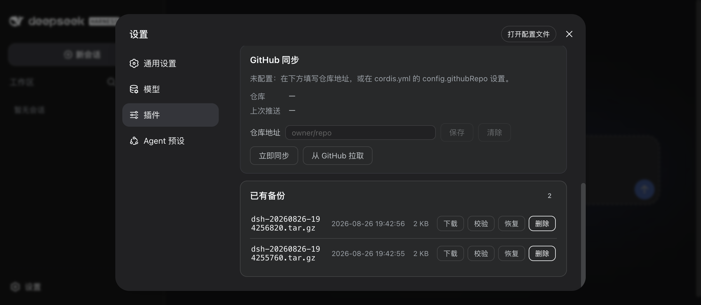
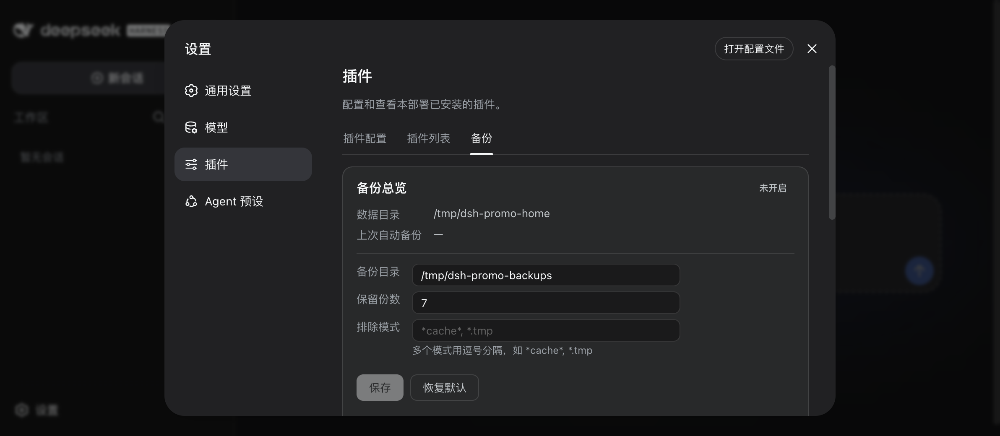

# dsh-backup

[](https://github.com/topics/dsh-plugin)
[](https://www.npmjs.com/package/@xiaoyuyu6420/dsh-backup)
[](https://www.npmjs.com/package/@xiaoyuyu6420/dsh-backup)
[](https://github.com/xiaoyuyu6420/dsh-backup/actions/workflows/publish.yml)
[](LICENSE)

[English](README.md) | 简体中文

**你所有的 DSH 工作数据都在一个目录里：`~/.dsh`。一次升级失败、一次误删、一次换电脑——没有备份，会话、设置、技能全没了。dsh-backup 用一条命令把它们找回来。**

```sh
dsh plugin --profile web add @xiaoyuyu6420/dsh-backup   # 安装
# 重启 dsh web，然后输入：
/backup                                                  # → 一份带校验的备份落在 ~/Desktop/dsh-backups/
```

v0.9.0 全新安装的真实输出：

```text
备份完成: dsh-20260826-195150036.tar.gz
sha256: 8f9ae6322ef782d21554981cf4547220d5bb3e64d7964a883317415ad54e3cbb
轮换删除 0 份（保留 7 份）
```

不想敲命令也行：`dsh web` → 设置 → 插件 → 备份 里有可视化面板——列备份、校验、恢复、删除、改设置，全都立即生效不用重启。



## 它替你挡掉哪些事

| 你担心的 | dsh-backup 做的事 |
|---|---|
| 「升级把环境搞坏了」 | 宿主版本一变就自动拍 `dsh-pre-upgrade-` 快照——放心试新版，坏了随时回滚 |
| 「我误删 / 改坏了东西」 | `/backup restore latest --dry-run` 先预览要恢复什么再动手；恢复失败自动回滚并给出结果回执 |
| 「DSH 根本起不来了」 | 每次备份都会往备份目录放一个零依赖的**救援控制台**（`dsh-rescue` / `rescue.mjs`，或双击「点我恢复」）——不依赖 DSH 的网页版恢复界面 |
| 「API Key 会被传到云上吗」 | 凭据默认脱敏，不进备份包；明文只存本机 vault，永不离开这台机器 |
| 「会话日志损坏了」 | `/backup doctor` 体检并从备份定点修复；损坏文件先隔离再入档，防止轮换把好副本也带走 |
| 「换新电脑了」 | GitHub 同步：`/backup github pull` 拉回云端备份，`restore --sync-deps` 顺手重装插件 |
| 「备份悄悄坏了没人知道」 | 每份归档带 sha256，`/backup verify all` 随时体检；每日/每周分级保留，留得住有用的历史 |
| 「我会忘记备份」 | `/backup auto 12`——每 12 小时自动跑，重启不中断，旧副本自动轮换（默认保留 7 份） |



## 安装

要求：macOS / Linux / Windows 10+（自带 `tar`），DSH `0.1.1-rc.2` 或兼容版本。

```sh
dsh plugin --profile web add @xiaoyuyu6420/dsh-backup
# 或者直接从 GitHub 安装：
dsh plugin --profile web add github:xiaoyuyu6420/dsh-backup
```

装完重启 `dsh web`。

## 快速上手

1. 按上面装好插件，重启 `dsh web`
2. 输入 `/backup`
3. 搞定 —— 备份出现在 `~/Desktop/dsh-backups/`，文件名带时间戳，旁边一份 `.sha256`

想定时自动跑？`/backup auto 12`（每 12 小时一次；`off` 关闭，`status` 看状态）。

## 命令速查

| 场景 | 命令 |
|---|---|
| 立即备份 | `/backup` |
| 定时备份（重启不中断） | `/backup auto 12` · `off` · `status` |
| 恢复（先预览） | `/backup restore latest --dry-run` |
| 正式恢复 | `/backup restore latest` |
| 列出备份 | `/backup list` |
| 校验完整性 | `/backup verify [前缀\|all]` |
| 会话日志体检/修复 | `/backup doctor` · `--repair [前缀\|latest]` |
| **DSH 起不来时自救** | 双击备份目录里的「点我恢复」，或 `dsh-rescue` / `node rescue.mjs` |
| 删除 / 保留策略 | `/backup delete <前缀\|latest>` · `/backup --keep N`（默认 7） |

## 换新电脑

前提：旧电脑配过 GitHub 同步（[配置方法](docs/advanced.zh.md#github-同步可选)）。

1. 新电脑装好插件，配置里填同一个 `githubRepo`
2. `/backup github pull` —— 拉回云端备份
3. `/backup restore latest --sync-deps` —— 恢复并重装插件依赖
4. 重启 `dsh`

## 常见问题

**API Key / 密码会进备份包吗？**
不会。已知的凭据文件打包前会脱敏，明文留在本机 vault 里不离开这台机器；恢复时自动还原。

**到底备份了什么？**
`~/.dsh` 下的全部——会话、设置、技能、插件配置——减去你配置的排除模式和 `node_modules`。

**我把 `~/.dsh` 搞坏了，`dsh` 都启动不了，还有救吗？**
有——这正是救援通道的用途。每次备份都会往备份目录写 `rescue.mjs` 和双击启动器（macOS `.command` / Windows `.bat` / Linux `.sh`）。它只用普通 Node 就能跑，不需要 DSH，起一个本地网页让你浏览和恢复备份。

**支持 Windows 吗？**
支持——Windows 10+（用系统自带 `tar`），救援启动器是 `.bat` 文件。

**备份默认放哪？**
`~/Desktop/dsh-backups/`——在面板（设置 → 插件 → 备份）里随时可改，立即生效不用重启。

## 反馈

用过吗？哪里坏了、缺什么、喜欢什么，都欢迎说——反馈直接决定路线图：

- 💬 [分享反馈（GitHub Discussions）](https://github.com/xiaoyuyu6420/dsh-backup/discussions)
- 🐛 [报告问题](https://github.com/xiaoyuyu6420/dsh-backup/issues)

## 更新日志

<details>
<summary>最近的版本</summary>

- **0.9.0** —— `/backup doctor` 会话日志体检与定点修复；宿主起不来也能用的进程外救援通道（备份目录里的 dsh-rescue / 双击启动器）；恢复失败自动回滚与结果导向回执；智能备份：宿主升级前自动快照、损坏会话先隔离再入档、每日/每周分级保留。
- **0.8.0** —— 面板里直接改备份设置（目录、保留份数、排除模式），立即生效写入 settings.yaml 不用重启；两处同时改有冲突提示，不会静默覆盖。
- **0.7.x** —— 凭据脱敏（本机 vault）、跨机恢复。

</details>

## 更多

定时备份策略、敏感文件脱敏、GitHub 同步、恢复保护机制、配置参考、故障排查、开发说明——都在[进阶文档](docs/advanced.zh.md)。跨运行时兼容性说明：[compatibility.md](docs/compatibility.md)。

## 致谢

- [@beastrobin](https://github.com/beastrobin) —— #1 中对保留方法名的根因分析，直接促成 v0.5.1 修复
- [@mlosun](https://github.com/mlosun) —— #2 中详尽的复现与根因报告
- [@Choi-Peng](https://github.com/Choi-Peng) —— #5 中协助把受影响用户指引到修复版本

## 许可证

MIT
